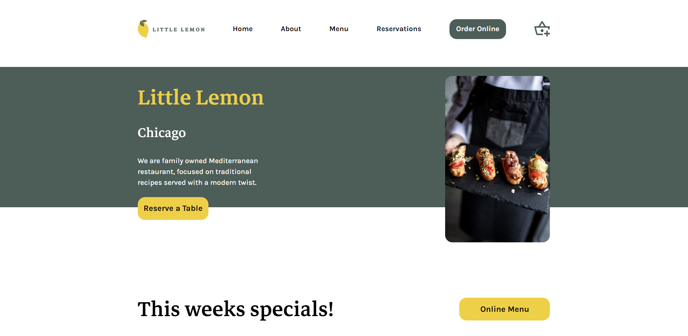
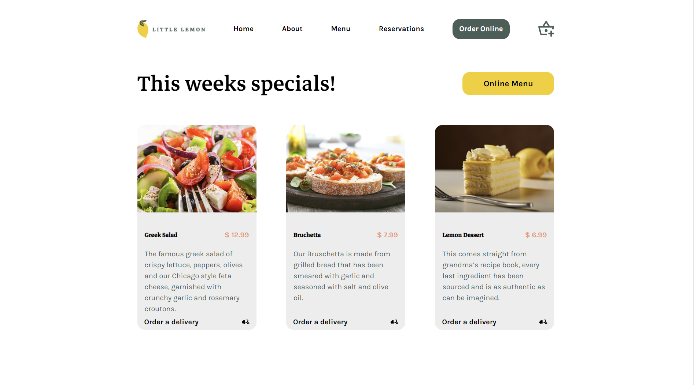
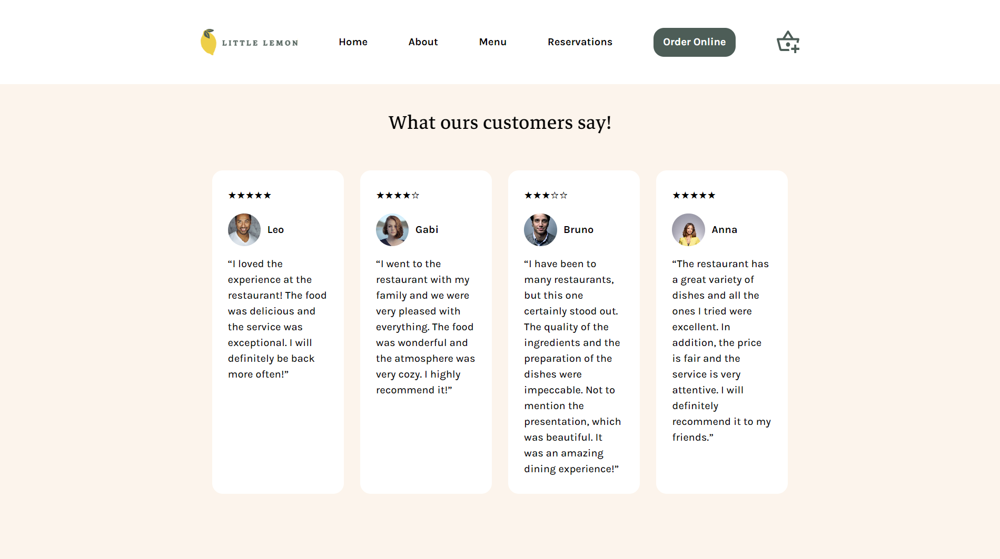
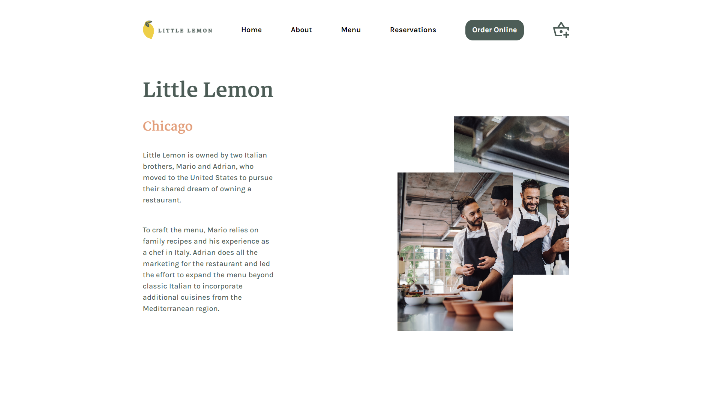
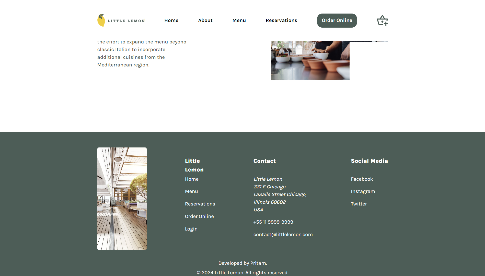
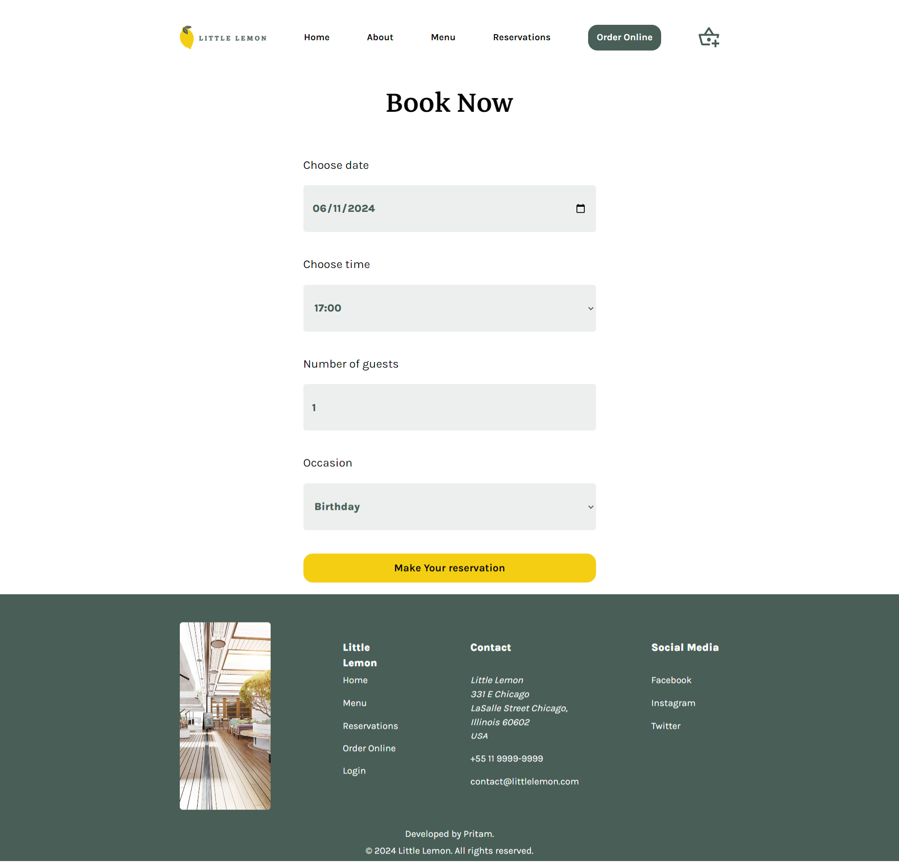
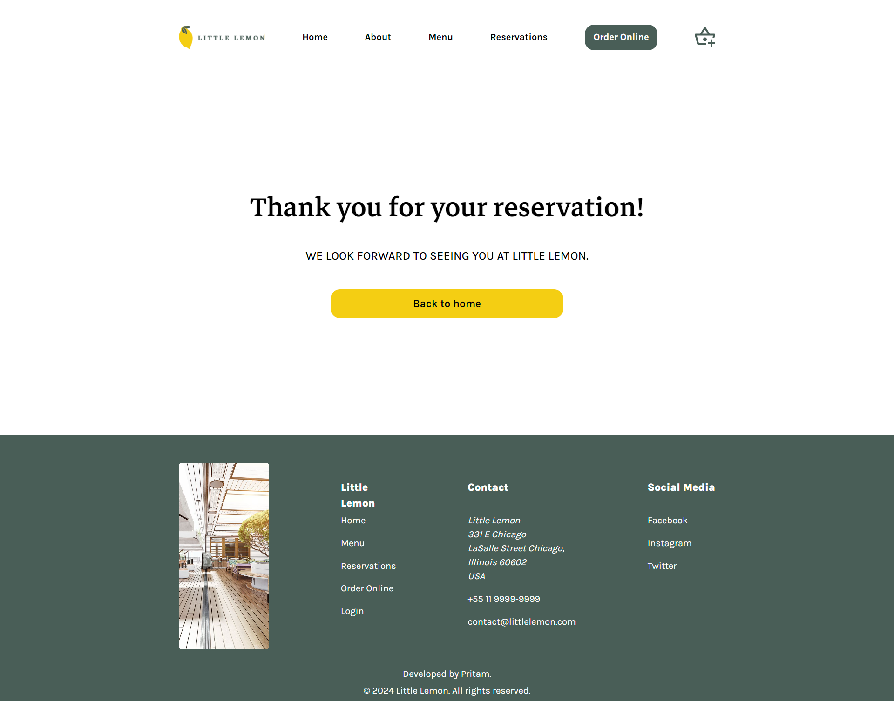

# Little Lemon Assignment


The little lemon app is the capstone project for the Meta Front-End Developer Professional Certificate program. This app is frontend template only, the main feature of the app is to reserve a table at a restaurant. The app is built using React JS and Typescript. The app is responsive and works on all devices.

## 📸 Screenshots









## 🚀 Technologies

This project was developed with the following technologies:

- React JS
- Typescript
- Styled Components
- Yup
- Formik
- Jest

## 💻 Getting started

### Requirements

- You need to install both [Node.js](https://nodejs.org/en/download/) to run this project.
- You also need to have a package manager either npm or yarn.
- And you need to have the [Git](https://git-scm.com/) installed on your machine to clone this project.
- Optionally, you can use the [VSCode](https://code.visualstudio.com/) as development IDE.
- Clone the project: `git clone https://github.com/meghoshpritam/little-lemon-table-booking.git`


**Follow the steps below**

```bash
# Install the dependencies
npm install
```

```bash
# Run the project
$ npm run dev
```
